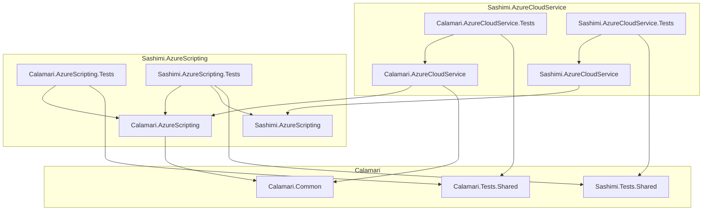

```mermaid
graph
subgraph Sashimi.AzureCloudService
  _1["Calamari.AzureCloudService"]
  _2["Calamari.AzureCloudService.Tests"]
  _3["Sashimi.AzureCloudService"]
  _4["Sashimi.AzureCloudService.Tests"]
  _2 --> _1
  _4 --> _3
end
subgraph Sashimi.AzureScripting
  _5["Calamari.AzureScripting"]
  _6["Calamari.AzureScripting.Tests"]
  _7["Sashimi.AzureScripting"]
  _8["Sashimi.AzureScripting.Tests"]
  _6 --> _5
  _8 --> _5
  _8 --> _7
end
subgraph Calamari
  _9["Calamari.Common"]
  _10["Calamari.Tests.Shared"]
  _11["Sashimi.Tests.Shared"]
end
_1 --> _5
_1 --> _9
_2 --> _10
_3 --> _7
_4 --> _11
_5 --> _9
_6 --> _10
_8 --> _11
```
